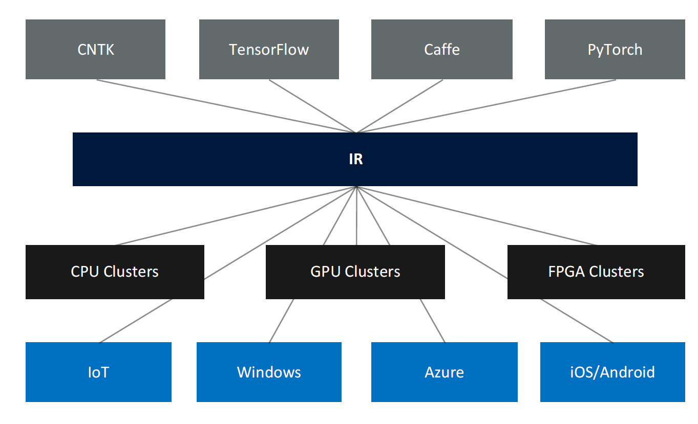
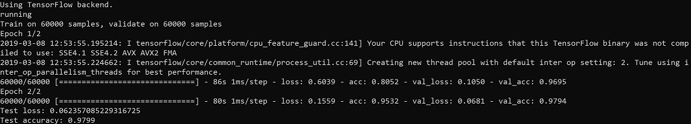
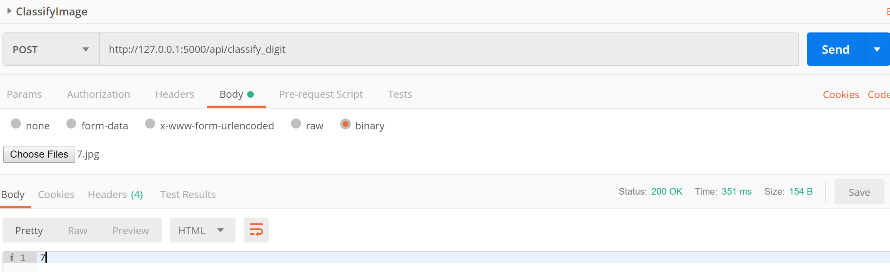

# Operationalizing a Deep Learning model (CNN) using ONNX, Keras, Tensorflow, and Flask

# What is ONNX?

ONNX (Open Neural Network Exchange) is an open format that represents deep learning models. It is a community project championed by Facebook and Microsoft. Currently there are many libraries and frameworks which do not interoperate, hence, the developers are often locked into using one framework or ecosystem. The goal of ONNX is to enable these libraries and frameworks to work together by sharing of models.

# Why ONNX?

ONNX provides an intermediate representation (IR) of models (see below), whether a model is created using CNTK, TensorFlow or another framework. The IR representation allows deployment of ONNX models to various targets, such as IoT, Windows, Azure or iOS/Android.



The intermediate representation provides data scientist with the ability to choose the best framework and tool for the job at hand, without having to worry about how it will be deployed and optimized for the deployment target.

# How ONNX?

ONNX provides two core components:
- Extensible computational graph model. This model is represented as an acyclic graph, consisting of a list of nodes with edges. It also contains metadata information,
such as author, version, etc.
- Operators. These form the nodes in a graph. They are portable across the frameworks and are currently of three types.
  - Core Operators - These are supported by all ONNX-compatible products.
  - Experimental Operators - Either supported or deprecated within few months.
  - Custom Ops - which are specific to a framework or runtime.

# Where ONNX?
ONNX empathizes on reusability, and there are four ways of obtaining ONNX models
- Public Repository – https://github.com/onnx/models
- Custom Vision Services (https://azure.microsoft.com/en-gb/services/cognitiveservices/
custom-vision-service/)
- Convert to ONNX model (https://docs.microsoft.com/en-us/windows/ai/convertmodel-
winmltools)
- Create your own in DSVM or Azure Machine Learning Services

For custom models and converters, please review the currently supported export and import model framework (https://github.com/onnx/tutorials)

# Step by Step

In this getting started guide, you will learn the followings:
1. How to install ONNX on your Machine
2. Creating a Deep Neural Network Model Using Keras
3. Exporting the trained Model using ONNX
4. Deploying ONNX in Python Flask using ONNX runtime as a Web Service

To run train the model and run the Flask application you first need to install a few Python libraries. Please use a *conda environment* if you don't want to interfere with any existing Python libraries such as numpy in your global conda environment. 

# Install required libraries
```bash
- pip install onnx
- pip install onnxmltools
- pip install winmltools
- pip install Keras
- pip install numpy==1.16
- pip install flask
- pip install opencv_python
```

# How to run the application


### Traing the model

```bash
python ModelTest.py
```

This will generate a file called onnxmodel.onnx in the current directory which contains the trained weights and parameters of the CNN model.
The ouptut of the above command should look like the following:


### Run the Flask application

```bash
export FLASK_APP=mnistws.py
python -m flask run
```
After running the commands above the flask application can be access at the following: http://127.0.0.1:5000/

### Use Postman to classify new number images

Postman is a desktop tool for API development and testing. It can be used to issue HTTP requests like GET and POST. We will use Postman to send images of numbers to the Flask application using HTTP POST.

1. Download Postman https://www.getpostman.com/downloads/
2. Open Postman and click on *Request(Create a basic request)*
3. Enter a name for the Request, option description, create a collection and add the request to it and then Save the request.
4. Then create a POST request and send an image of a number that you have a downloaded from the web. 

